# Old School Games
The user can visit this website to play Old School games. The website recently went live with just one game, but more games will be added on a regular basis. The idea is to create retro games where you can alter the rules to make them different or leave them as we all remember them.

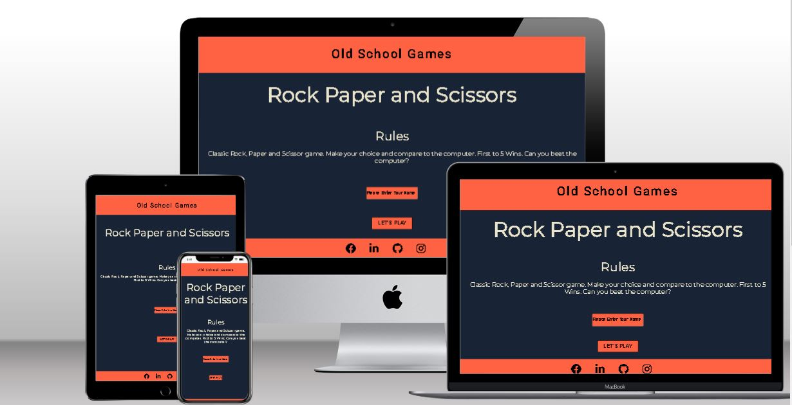

# Live Site
[Old School Games](https://stealthy20.github.io/old-school-games/)
# Repository
[GitHub](https://github.com/Stealthy20/old-school-games/)
# Features
**This site contains the following content**
We immediately start playing the Rock, Paper, Scissors game when the website first launches.
You have the option to enter your name here, and it will appear in the game. If left blank, "Player" will be shown in its place.

## Existing Features
 **Header**
  - Header with the name of the site. 

## Game Area
- Game area where the game plays

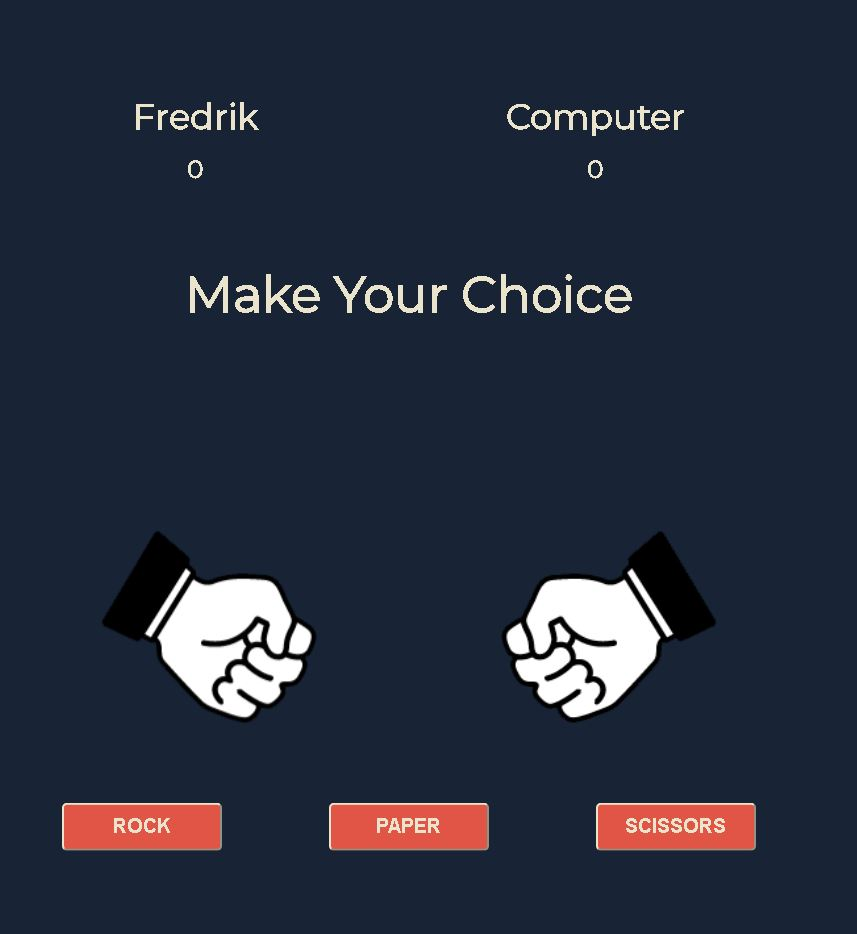

**Footer**
  - A fully responsive footer with links to my social media. 
  - Hover effect on the elements to make sure the user knows that they are clickable. 

## Upcoming features 
  - More games on the site. The first games to come are
  - Snake
  - Hangman
  - Frogger
  - An area before a game is launched where you can choose if you want to make changes to the rules.

# Testing
The site was tested all through the project to make sure that every little part worked. 
This was done with console.log results to make sure that small functions or parts of bigger functions were working as intended before proceeding. 

I have gathered some of the problems and bugs that I encountered and will show them below. 
These were only a handful of the challenges that I encountered during this project.

## Bugs and problems

- **Bug 1**
    - I tried to get the console to log the inner HTML of the button that I clicked so that I could compare this to the computer's random choice.
   And as you can see in the picture the console didn't recognize the buttons.

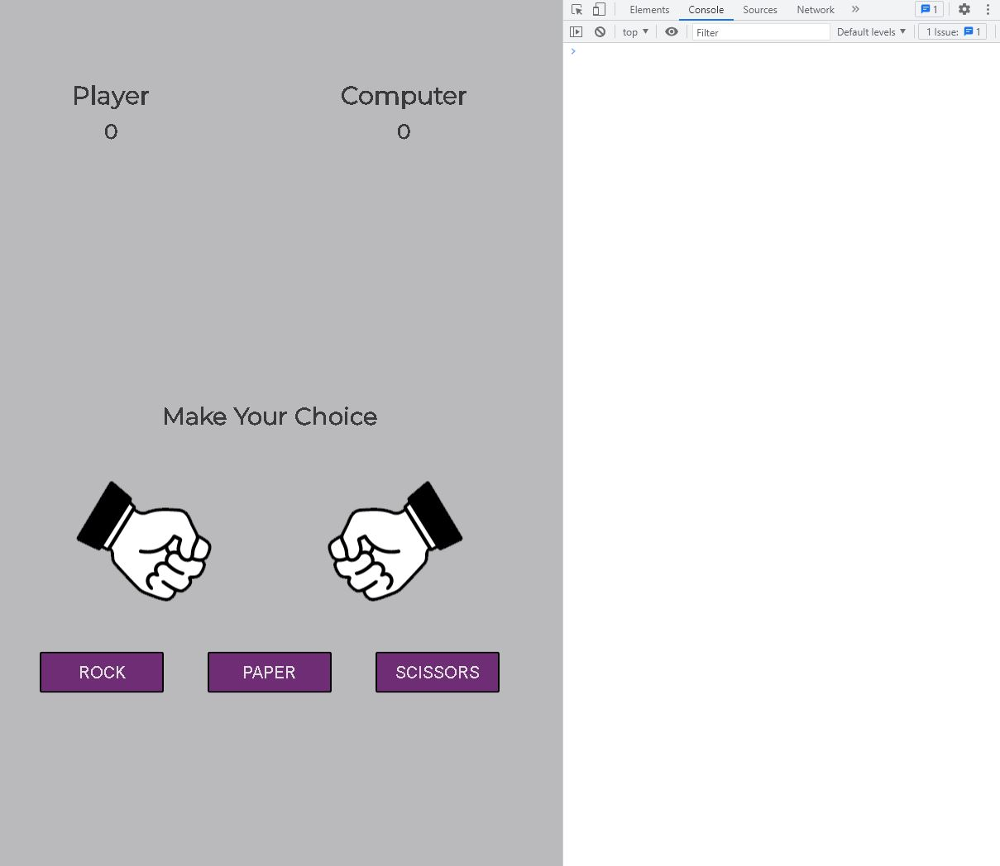 

- **Fix for bug 1**
    - Added a queryselector to choose all the buttons. After that, I added an eventlistener to run a function where I extracted the text with this.textContent;

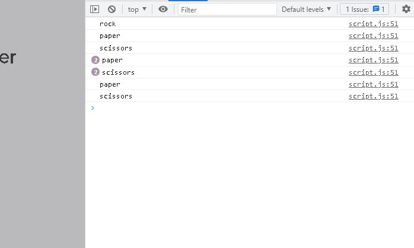 

- **Bug 2**
    - Error message "outcome is not defined at compareHands" when I tried to compare my choice to the computer's random choice.

 

- **Fix for bug 2**
    - I had a wrongly named variable that made the player choice to compare to nothing. 

- **Bug 3**
  - Was not able to access the playersChoice in my function where I would compare the player's choice and the computer's random choice.
  Everything was always a Tie in the game 

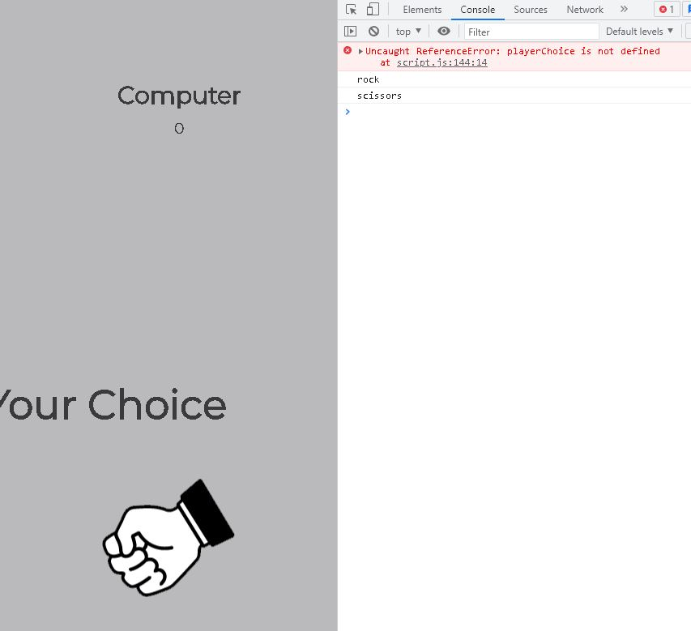 

- **Fix for bug 3**
   - Instead of having the player choice and the computer random choice in two different functions. I added them together into the game function. 

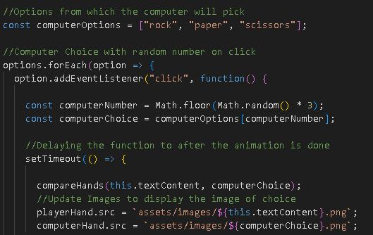 

- **Bug 4**
   - When the game was over and the player or computer had won the scores didn't update, and I got an error in the console.

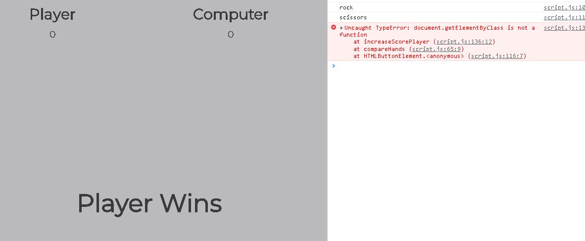 

- **Fix for bug 4**
    - After alot of seartching and trying, i noticed that document.getElementByClass should be document.getElementById.

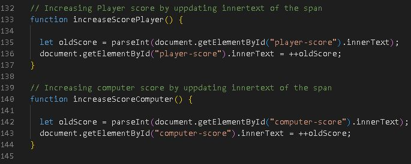 

- **Bug 5**
  - Ran my website through Lighthouse and got a 92% on best practice. 

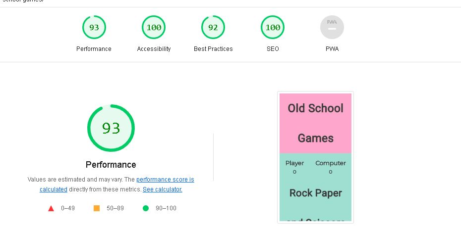 

- **Fix for bug 5**
  - I didn't have a set height or width for my images. Set width in my CSS file to look good on the site and set the height to auto.
  Got 100% on best practice after this. 

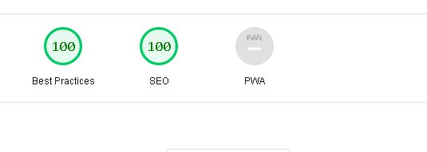 

- **Bug 6**
  - I got an error message of "Uncaught TypeError: Cannot set properties of null (setting 'innerHTML')" in my console when players tried to choose their own name. 

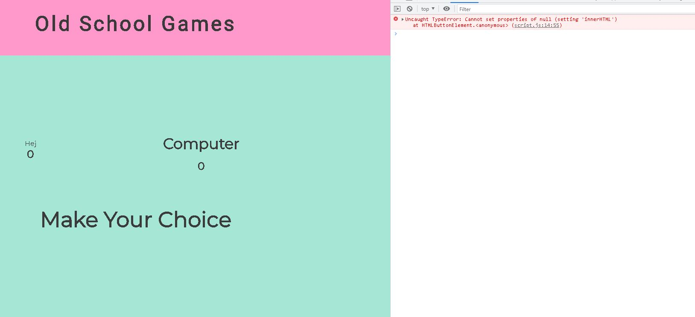 

- **Fix for bug 6**
  - I had some extra code that wasn't needed and caused the error. 
  Cleaned it and added it to the eventlistener to start the game. Everything works as intended. 

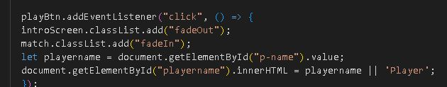 

## Responsiveness
- **This was tested manually with Dev tools. I tried with my code using flex to avoid as many media queries as possible. I chose as few breakpoints as I could while still keeping the site looking good on all screens.**
    - Ended up using two breakpoints. 
    - 500px and down: At this point header, footer, headings, and buttons didn't fit the screen anymore.
    - 420px and down: To fit the smallest screen I needed to make headings, buttons, and some text even smaller to fit.

## Validator Testing
  - **HTML through W3C Validator**
    - No errors
  - **CSS through Jigsaw Validator**
    - No errors
  - **Javascript through Jshint Validator**
    - No errors 
  - **Contrast validator through WebAim**
    - No errors
  - **Accessibility check through Wave**
    - No errors

## Technology Used
- HTML
- CSS
- Javascript
- Font Awesome
- Favicon

# Deployment
I deployed this website by using GitPages and following the steps below:

- GitHub pages deployment
  - Log in to GitHub
  - In your Repository section, select the project repository that you want to deploy.
  - In the menu located at the top of this section, click "Settings".
  - Select "Pages" on the left-hand menu.
  - In the source section, select branch "Main" and save
  - The page is then given a site URL which you will see above the source section. Wait a minute and refresh the page.
  - The background around your URL should have turned green with a check mark before it. 
  - It's now live and ready to share.

 **Forking the Guthub Repository.**
- You can fork the original GitHub Respository to be able to view or make changes without it affecting the original repository.
  - Go to the GitHub repository.
  - in the top right, press the button named "Fork".
  - You will now have a copy of the repository in your own GitHub. 

**Make a Local Clone**
- Go to the GitHub Repository.
  - Click the "Clone" button in the top of the repository.
  - Copy the link.
  - Open Git Bash.
  - Change the current working directory to the location where you want the cloned directory.
  - Type git clone, and then paste the URL you copied earlier.
  - Press Enter to create your local clone.

# Credits
  - I used a guide on Youtube to inspire me and help when I got stuck. [GitHub](https://github.com/Stealthy20/old-school-games/)[DevEd Channel](https://www.youtube.com/c/DevEd)
  - Icons in the footer are from [Font Awesome](https://fontawesome.com/)

