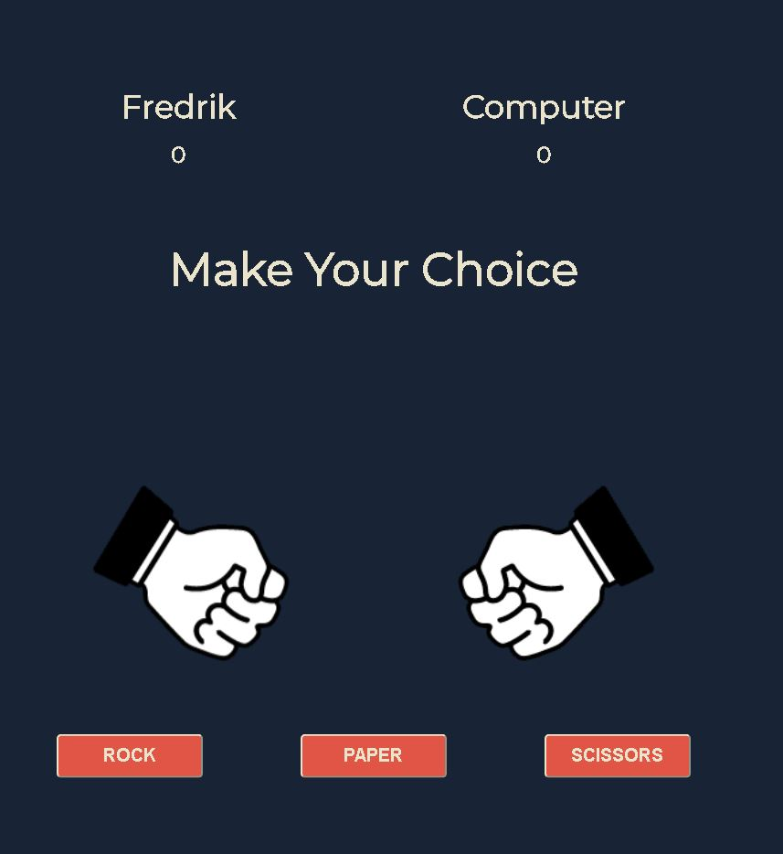

# Old School Games
This is a site where the user can come to play Old School games.
The site is just launched with only one game, but will be continuously updated with more games.
The vision is to have old school games where you can choose to change some rules to make it diffrent, or not to keep it as we all remember them.

// Make a Mockup at https://techsini.com/multi-mockup/index.php

# Live Site
[Old School Games](https://stealthy20.github.io/old-school-games/)
# Repository
[GitHub](https://github.com/Stealthy20/old-school-games/)
# Features
**This site contains the following content**
In the first launch of this site we land directly into the Rock, Paper and Scissors game.

## Existing Features
 **Header**
  - Header with the name of the site. 

## Game Area
- Game area where the game plays

**Footer**
    - A fully responsive footer with links to my social media. 
    - Hover effect on the elements to make sure the user knows that they are clickable. 

## Upcoming features 
    - More games to the site. The first games to come is
    - Snake
    - Hangman
    - Frogger

    - An area before game is launched where you can choose if you want to make changes to the rules.

# Testing

## Bugs

## Responsiveness

## Validator Testing
  - **HTML through W3C Validator**
    - No errors
  - **CSS through Jigsaw Validator**
    - No errors
  - **Contrast validator through WebAim**
    - No errors
  - **Accessibility check through Wave**
    - No errors
## Technology Used
- HTML
- CSS
- Javascript
- Font Awesome
- Favicon

# Deployment
I deployed this website by using GitPages and following the steps below:

- GitHub pages deployment
  - Log in to GitHub
  - In your Repository section, select the project repository that you want to deploy.
  - In the menu located at the top of this section, click "Settings".
  - Select "Pages" on the left-hand menu.
  - In the source section, select branch "Main" and save
  - The page is then given a site URL which you will see above the source section. Wait a minute and refresh the page.
  - The background around your URL should have turned green with a check mark before it. 
  - It's now live and ready to share.

 **Forking the Guthub Repository.**
- You can fork the original GitHub Respository to be able to view or make changes without it affecting the original repository.
  - Go to the GitHub repository.
  - in the top right, press the button named "Fork".
  - You will now have a copy of the repository in your own GitHub. 

**Make a Local Clone**
- Go to the GitHub Repository.
  - Click the "Clone" button in the top of the repository.
  - Copy the link.
  - Open Git Bash.
  - Change the current working directory to the location where you want the cloned directory.
  - Type git clone, and then paste the URL you copied earlier.
  - Press Enter to create your local clone.

  # Credits